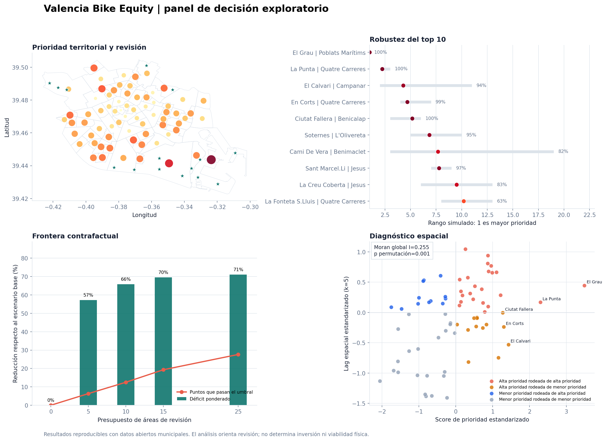
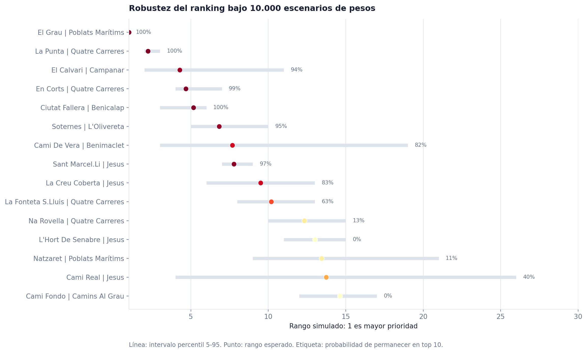

# Valencia Bike Equity

[](https://github.com/0227lia/valencia-bike-equity-analysis/actions/workflows/ci.yml)

Sistema reproducible de apoyo exploratorio para revisar la equidad territorial del aparcamiento de bicicletas en Valencia. Integra datos abiertos municipales, análisis geoespacial, robustez multicriterio, diagnóstico espacial y una simulación contrafactual de áreas de revisión.



## Problema

Una red amplia de aparcamientos no implica una cobertura comparable entre barrios. El proyecto responde a cuatro preguntas:

1. ¿Qué barrios combinan vulnerabilidad, menor capacidad declarada y peor accesibilidad espacial?
2. ¿Qué posiciones del ranking siguen siendo estables cuando cambian las prioridades de política pública?
3. ¿Existe agrupación espacial en la señal de prioridad?
4. ¿Qué zonas merecen revisión de calle bajo una cartera contrafactual con restricciones explícitas?

Las áreas resultantes son **puntos de cribado modelados**, no propuestas de obra ni recomendaciones de inversión.

## Resultados de la ejecución incluida

Los siguientes resultados se generan desde el snapshot público versionado en el repositorio:

- 4.316 puntos de aparcamiento y 70 barrios procesados.
- 617 puntos de malla de diagnóstico a 300 m y 2.395 puntos de simulación a 150 m.
- `EL GRAU` mantiene el rango 1 en el 100% de los 10.000 escenarios de pesos ejecutados.
- Nueve barrios presentan una probabilidad de al menos 80% de permanecer en el top 10 bajo esa simulación.
- Moran global de prioridad: `I = 0.255`; prueba bilateral por 999 permutaciones: `p = 0.001`.
- La cartera contrafactual de 25 áreas de revisión reduce el déficit de distancia ponderado un 71,0% y lleva 179 puntos de malla por debajo del umbral de 250 m.

Estas cifras no estiman demanda, coste, capacidad futura ni viabilidad física. Consulta el [resumen ejecutivo](reports/executive_summary.md) y la [tarjeta de decisión](docs/DECISION_MODEL.md) antes de interpretar los resultados.

## Enfoque

```text
Snapshots de datos abiertos
            |
Normalización espacial y trazabilidad SHA-256
            |
Mallas de accesibilidad (300 m y 150 m)
            |
MCDA transparente + escenarios fijos
            |
10.000 simulaciones Dirichlet de pesos
            |
Moran global + cuadrantes espaciales descriptivos
            |
Selección greedy de áreas de revisión y frontera de impacto
            |
Tablas, gráficos, resumen y dashboard Streamlit
```

### Score de prioridad base

Cada componente se normaliza entre 0 y 1. El score base es:

```text
0,40 vulnerabilidad + 0,30 déficit de plazas + 0,20 déficit de accesibilidad + 0,10 cobertura insuficiente
```

El [documento metodológico](docs/METHODOLOGY.md) explica la construcción de cada señal, el muestreo de pesos, el test espacial y la simulación contrafactual.

## Dashboard interactivo

El dashboard permite explorar pesos, movimientos en el ranking, la cartera base de zonas de revisión y el patrón espacial:

```bash
streamlit run app.py
```



## Tecnologías

- Python, pandas y NumPy.
- Shapely y pyproj para geometrías, asignación espacial y transformación `EPSG:25830 -> EPSG:4326`.
- Matplotlib y Plotly para visualización estática e interactiva.
- Streamlit para el dashboard local.
- pytest, Ruff y GitHub Actions para calidad y reconstrucción continua.

## Instalación

```bash
python -m venv .venv
```

En Windows:

```powershell
.venv\Scripts\Activate.ps1
python -m pip install -r requirements-dev.txt
```

En macOS o Linux:

```bash
source .venv/bin/activate
python -m pip install -r requirements-dev.txt
```

## Ejecución reproducible

El snapshot incluido permite ejecutar todo sin red:

```bash
python src/run_pipeline.py
```

Para actualizar las fuentes públicas antes de reconstruir:

```bash
python src/fetch_data.py
python src/run_pipeline.py
```

## Validación

```bash
python -m ruff check .
python -m pytest
python src/run_pipeline.py
```

La integración continua ejecuta estos controles y reconstruye el análisis desde los snapshots versionados.

## Salidas principales

| Salida | Contenido |
|---|---|
| `data/processed/neighborhood_equity_scores.csv` | Señales, score, ranking robusto y cuadrante espacial por barrio. |
| `data/processed/weight_robustness.csv` | Intervalos de score y rango de 10.000 simulaciones. |
| `data/processed/planning_grid.csv` | Malla de 150 m usada en la simulación. |
| `data/processed/candidate_locations.csv` | Áreas de revisión modeladas con ganancias marginales. |
| `reports/coverage_frontier.csv` | Impacto acumulado por presupuesto de cartera. |
| `reports/spatial_diagnostics.json` | Moran global y distribución por permutaciones. |
| `reports/figures/equity_decision_dashboard.png` | Panel estático para revisión rápida. |

El [diccionario de datos](docs/DATA_DICTIONARY.md) detalla las columnas y la [tarjeta de decisión](docs/DECISION_MODEL.md) delimita usos y riesgos.

## Datos y privacidad

Los datos proceden de fuentes abiertas del Ayuntamiento de Valencia y no contienen datos personales:

- [Aparcamientos de bicicleta](https://opendata.vlci.valencia.es/dataset/aparcaments-bicicletes-aparcamientos-bicicletas)
- [Vulnerabilidad por barrios](https://opendata.vlci.valencia.es/dataset/vulnerabilidad-por-barrios)

`data/raw/source_manifest.json` conserva URL, fecha de descarga, número de registros y hash SHA-256 de cada snapshot. Revisa las condiciones de reutilización de las fuentes antes de redistribuir los datos.

## Limitaciones

- Distancias geodésicas en línea recta; no representa rutas ciclistas ni barreras urbanas.
- Sin demanda ciclista, ocupación, población, coste, disponibilidad de espacio o restricciones de calle.
- Los pesos expresan una política analítica; la robustez mide sensibilidad a esos pesos, no causalidad.
- Moran es una señal global exploratoria; los cuadrantes locales no son tests de significación individual.

## Autor

Proyecto de portfolio de Ciencia de Datos desarrollado por [0227lia](https://github.com/0227lia). Código bajo licencia MIT; los datasets conservan los términos de sus fuentes.
