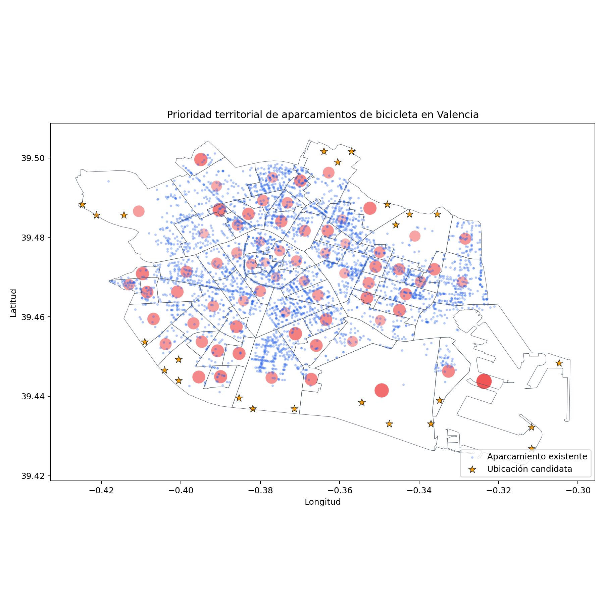
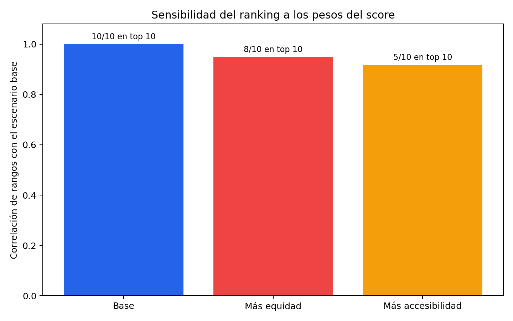

# Equidad del aparcamiento de bicicletas en Valencia

[](https://github.com/0227lia/valencia-bike-equity-analysis/actions/workflows/ci.yml)

Análisis geoespacial reproducible para comparar cobertura, capacidad y vulnerabilidad urbana por barrio, y detectar zonas que merecen una revisión más detallada.



## Problema

Una distribución amplia de aparcamientos no garantiza que todos los barrios tengan una cobertura comparable. El proyecto responde:

1. ¿Qué barrios combinan mayor vulnerabilidad y menor cobertura?
2. ¿Hasta qué punto cambia el ranking al modificar las prioridades de política pública?
3. ¿Qué zonas alejadas de la infraestructura existente podrían revisarse sobre el terreno?

## Resultados de la ejecución incluida

- 4.316 puntos de aparcamiento procesados.
- 70 barrios analizados.
- 617 puntos interiores usados para estimar accesibilidad.
- 24 ubicaciones candidatas tras aplicar separación y límite por barrio.
- `EL GRAU` ocupa la primera posición en el escenario base.
- El escenario centrado en equidad conserva 8 de los 10 primeros barrios.
- El escenario centrado en accesibilidad conserva 5 de los 10 primeros barrios.

Los candidatos no son propuestas de obra. No se han validado espacio físico, propiedad, red viaria, demanda ni restricciones urbanísticas.



## Tecnologías

- Python, pandas y NumPy.
- `pyproj` para transformar `EPSG:25830` a coordenadas geográficas.
- Shapely para geometrías y asignación espacial.
- Matplotlib para mapas y gráficos.
- `truststore` para descargar datos con TLS verificado.
- pytest, Ruff y GitHub Actions para validación.

## Flujo del proyecto

```text
ArcGIS + GeoJSON
       │
       ├─> descarga segura + manifiesto SHA-256
       ├─> transformación de coordenadas y geometrías
       ├─> asignación de aparcamientos a barrios
       ├─> malla de accesibilidad y distancias
       ├─> score base + escenarios de sensibilidad
       └─> candidatos, tablas, figuras y resumen ejecutivo
```

## Instalación

```bash
python -m venv .venv
```

Windows:

```powershell
.venv\Scripts\Activate.ps1
python -m pip install -r requirements.txt
```

macOS o Linux:

```bash
source .venv/bin/activate
python -m pip install -r requirements.txt
```

## Ejecución

El snapshot público incluido permite reconstruir todo sin conexión:

```bash
python src/run_pipeline.py
```

Para actualizar primero las fuentes:

```bash
python src/fetch_data.py
python src/run_pipeline.py
```

## Validación

```bash
python -m pip install -r requirements-dev.txt
ruff check .
pytest
```

## Salidas principales

- `data/processed/neighborhood_equity_scores.csv`
- `data/processed/candidate_locations.csv`
- `reports/sensitivity_analysis.csv`
- `reports/executive_summary.md`
- `reports/figures/priority_map.png`
- `reports/figures/top_priority_neighborhoods.png`
- `reports/figures/vulnerability_vs_capacity.png`
- `reports/figures/ranking_sensitivity.png`

El [diccionario de datos](docs/DATA_DICTIONARY.md) describe las columnas y la [metodología](docs/METHODOLOGY.md) documenta supuestos, pesos y limitaciones.

## Fuentes

- [Aparcamientos de bicicleta - Datos Abiertos Valencia](https://opendata.vlci.valencia.es/dataset/aparcaments-bicicletes-aparcamientos-bicicletas)
- [Vulnerabilidad por barrios - Datos Abiertos Valencia](https://opendata.vlci.valencia.es/dataset/vulnerabilidad-por-barrios)

## Autor

Desarrollado por [0227lia](https://github.com/0227lia) como proyecto de portfolio de Ciencia de Datos.

El código se publica con licencia MIT. Los datasets mantienen las condiciones indicadas por sus fuentes originales.
